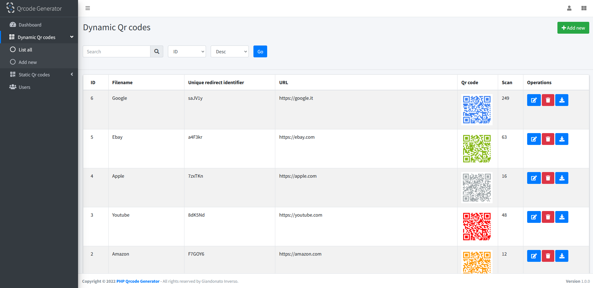

<!--
N.B.: Diese README wurde automatisch von <https://github.com/YunoHost/apps/tree/master/tools/readme_generator> generiert.
Sie darf NICHT von Hand bearbeitet werden.
-->

# Dynamic Qr code für YunoHost

[](https://ci-apps.yunohost.org/ci/apps/dynamicqrcode/)


[](https://install-app.yunohost.org/?app=dynamicqrcode)

*[Dieses README in anderen Sprachen lesen.](./ALL_README.md)*

> *Mit diesem Paket können Sie Dynamic Qr code schnell und einfach auf einem YunoHost-Server installieren.*  
> *Wenn Sie YunoHost nicht haben, lesen Sie bitte [die Anleitung](https://yunohost.org/install), um zu erfahren, wie Sie es installieren.*

## Übersicht

PHP Dynamic Qr code is a script that allows the generation and saving of dynamic and static QR codes. It has a clean, responsive, and user-friendly design. It is based on AdminLte. Built on top of Bootstrap" and Core PHP Admin Panel, a simple Admin Panel written in core PHP that contains an implementation of general features you might need in your website admin panel like: record management (CRUD), secure authentication, pagination, filters.

**Ausgelieferte Version:** 2.3~ynh1

**Demo:** <https://giandonatoinverso.it/qrcode/login.php>

## Bildschirmfotos



## Dokumentation und Ressourcen

- Offizielle Verwaltungsdokumentation: <https://giandonatoinverso.it/qrcode/documentation/>
- Upstream App Repository: <https://github.com/giandonatoinverso/PHP-Dynamic-Qr-code>
- YunoHost-Shop: <https://apps.yunohost.org/app/dynamicqrcode>
- Einen Fehler melden: <https://github.com/YunoHost-Apps/dynamicqrcode_ynh/issues>

## Entwicklerinformationen

Bitte senden Sie Ihren Pull-Request an den [`testing` branch](https://github.com/YunoHost-Apps/dynamicqrcode_ynh/tree/testing).

Um den `testing` Branch auszuprobieren, gehen Sie bitte wie folgt vor:

```bash
sudo yunohost app install https://github.com/YunoHost-Apps/dynamicqrcode_ynh/tree/testing --debug
oder
sudo yunohost app upgrade dynamicqrcode -u https://github.com/YunoHost-Apps/dynamicqrcode_ynh/tree/testing --debug
```

**Weitere Informationen zur App-Paketierung:** <https://yunohost.org/packaging_apps>
