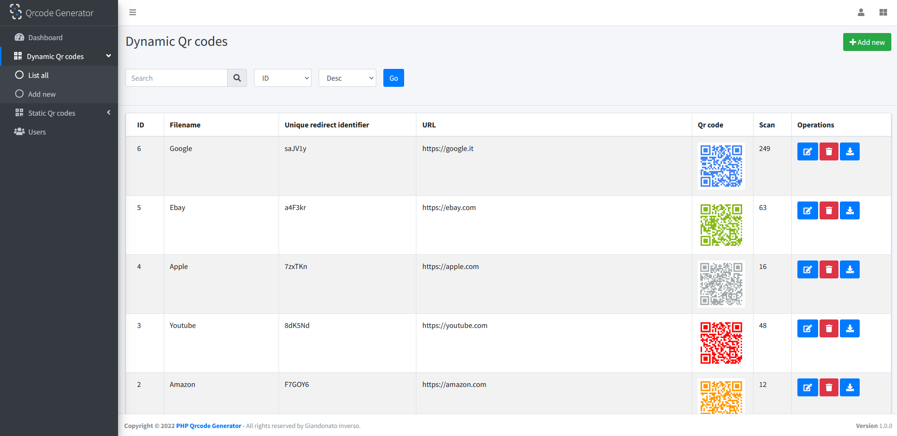

<!--
NOTA: Este README foi creado automáticamente por <https://github.com/YunoHost/apps/tree/master/tools/readme_generator>
NON debe editarse manualmente.
-->

# qrcode para YunoHost

[](https://dash.yunohost.org/appci/app/qrcode)  

[](https://install-app.yunohost.org/?app=qrcode)

*[Le este README en outros idiomas.](./ALL_README.md)*

> *Este paquete permíteche instalar qrcode de xeito rápido e doado nun servidor YunoHost.*  
> *Se non usas YunoHost, le a [documentación](https://yunohost.org/install) para saber como instalalo.*

## Vista xeral

PHP Dynamic Qr code is a script that allows the generation and saving of dynamic and static QR codes. It has a clean, responsive, and user-friendly design. It is based on AdminLte. Built on top of Bootstrap" and Core PHP Admin Panel, a simple Admin Panel written in core PHP that contains an implementation of general features you might need in your website admin panel like: record management (CRUD), secure authentication, pagination, filters.

**Versión proporcionada:** 2.2.7~ynh1

**Demo:** <https://giandonatoinverso.it/qrcode/login.php>

## Capturas de pantalla



## Documentación e recursos

- Documentación oficial para admin: <https://giandonatoinverso.it/qrcode/documentation/>
- Repositorio de orixe do código: <https://github.com/giandonatoinverso/PHP-Dynamic-Qr-code>
- Tenda YunoHost: <https://apps.yunohost.org/app/qrcode>
- Informar dun problema: <https://github.com/YunoHost-Apps/qrcode_ynh/issues>

## Info de desenvolvemento

Envía a túa colaboración á [rama `testing`](https://github.com/YunoHost-Apps/qrcode_ynh/tree/testing).

Para probar a rama `testing`, procede deste xeito:

```bash
sudo yunohost app install https://github.com/YunoHost-Apps/qrcode_ynh/tree/testing --debug
ou
sudo yunohost app upgrade qrcode -u https://github.com/YunoHost-Apps/qrcode_ynh/tree/testing --debug
```

**Máis info sobre o empaquetado da app:** <https://yunohost.org/packaging_apps>
